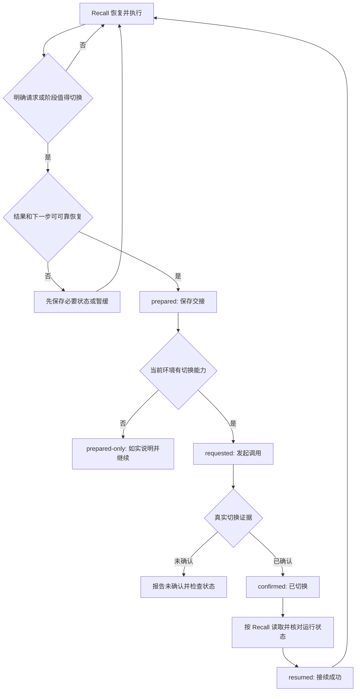

# Recall Compact 完整设计

设计日期：2026-09-08。本文解释设计，当前规则以 [宪法](../logic_readme.md) 和 [领域规则](../logic_domains/compact/logic_readme.md) 为准。

## 要解决的问题

长任务会积累已经失去价值的搜索输出、失败尝试和旧阶段细节。只写一段摘要不会释放上下文；切换后如果又读取全部历史，也会失去节省效果。
目标是在阶段成果可恢复时，保留任务所需的最少信息，调用运行环境提供的能力，然后按 Recall 恢复并继续。不是保证每个任务都更省 token：重读必需规则有固定成本。

## 职责分配

| 部件 | 负责 | 边界 |
|---|---|---|
| Recall | 项目规则、意图、CHG、VER、下一步与必要恢复 | 不在本项目复制其制度 |
| Recall Compact | 切换时机、交接检查、调用能力、恢复接续 | 不增加业务授权，不自动晋升 CHG |
| 宿主 | 上下文切换/压缩及可恢复状态能力 | Skill 无法创造宿主没有的工具 |
| 本机安装入口 | 默认组合两个技能的短配置指针 | 上游 Recall 维护源保持不变 |
| GitHub 仓库 | 发布代码、模板和使用说明 | 不上传真实交接数据、聊天或凭据 |

## 状态流程

同一次流程保留事件标识、触发原因与恢复标志，避免刚恢复就再次进入切换。无需单独后台服务、定时器或每步计数器。
紧急容量压力时可优先保存最小交接，但仍须保持授权与未明外部操作状态，不能把上下文临近上限当作跳过事实核对的理由。

## 触发依据与代价

- 明确要求：在保存必要状态后执行，不人为增加 token 门槛。
- 自动联用：阶段可恢复，加上实际压力或下一阶段明显转向，才考虑切换。
- 有 runtime 用量工具就参考真实数据；没有就定性判断，不能从 config.toml 推导精确用量。
- 不采用固定 80%/90% 或“每完成一个子任务”：不同模型、宿主和任务的成本不同。
- 频繁小任务切换可能增加根规则重读成本；切换不能减少已经消耗的 token，也不保证降低总费用。

## 交接怎样与项目账本配合

持久项目事实继续使用 Recall 已指定的 readme/change/VER。交接只加恢复所需的执行信息和指针，不复制整份规则，不把议案转成现行制度。
运行中的任务、分工、文件归属、进程或远程操作句柄需保留；恢复先查询结果，再决定是否继续，不能盲目重放。
临时交接使用宿主支持的可恢复载体。若需要文件，遵循消费项目的工作区产物登记与排除提交规则；本项目不规定跨项目统一的运行数据路径。

执行交接采用当前快照：最新目标、完成状态和下一步放在开头。后续刷新自己维护的可变快照，把已经失效的“下一步”替换为真实现状；已结束阶段缩为必要结果和来源，不持续追加整段旧摘要。授权、停止点和未明操作仍须保留，项目制度和不可变历史不受这种整理影响。
恢复先核对新用户输入，判断补充、纠正或新任务，再查当前文件和运行状态。仍按 Recall 亲自重读必需规则，其余证据按下一步需要获取；切换前后的事件状态分别核实，不用上次成功填充本次结果。

## 默认联用设计

安装器在技能搜索目录创建 recall-compact 的短入口，指向本仓库 SKILL.md；在用户指定的 Recall 本机入口追加一个带边界标记的配置块，指向同一维护源。
调用 $recall 时，入口中的配置会要求顺序加载附属技能；主流程仍由 Recall 管理。description 保持自动发现，用户也可显式调用 $recall-compact。
这是模型遵循入口指令的默认联用，不是宿主提供的强制钩子。现有任务若缓存了旧入口，应明确重新读取；新任务读取更新入口即可。不同客户端发现机制可能需重新加载技能或重启。

只支持已有独立本机指针入口。完整 Recall 维护源不能作为 --recall-entry；安装器不会改写它。换机后重新运行安装。移动源仓库前，先在原路径运行 uninstall --apply 解除旧指针，再移动并从新路径安装；若先移动导致旧指针残留，应先恢复原路径再撤销，安装器不会猜测并改写陌生配置。安装器拒绝符号链接与 Windows junction 路径。本机绝对路径只写入本机配置，不提交到 GitHub。

## 选择与回滚

| 方案 | 收益 | 代价/结论 |
|---|---|---|
| 改 Recall 维护源 | 所有直接消费者都收到默认联用 | 改动上游分发行为、增加耦合；本版不采用 |
| 仅靠附属技能 description | 无入口改动 | 无法确保单独调用 Recall 时加载；只作补充 |
| 本机入口短指针 | 保留上游、默认联用且可撤销 | 换机要安装，入口覆盖后需 status 核对；采用 |

撤销先移除所拥有的联用块，再删除精确匹配的附属技能指针；保留用户在块外添加的任何文本。未知改动、标记损坏或目标不是本机指针时拒绝修改。安装前预览所有目标，写入前重新核对基线。撤销不删除源仓库、消费项目记录或真实交接。

## 能力与可验证结论

本项目没有模拟压缩的 Python API，也不直接调用模型服务。安装器测试只证明配置处理。
在提供 functions.new_context 的环境可执行“保存交接后切换上下文”；不能把它宣传成所有 Codex/Claude 环境通用的内置 /compact API。
没有工具时仍能整理交接并继续原任务，但必须标明未切换。实际释放 token 数、1M 生效容量、总成本收益都需要对应环境的真实观测。

## 非目标

不修改模型/提供者/容量设置，不升级 Recall，不复制 Recall 仓库，不自动创建子代理，不自动发布消费项目，不把默认联用解释为新的生产授权。
